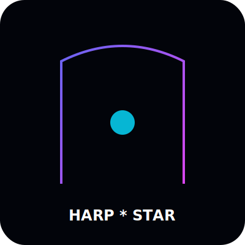

# 🌟 Harp * Star Media Mind Master 🌟

<p align="center">
  
</p>

> **The Ultimate Multi-Root Intelligence & Media Orchestration Nexus.**  
> *Sovereignty through automated intelligence. Protected by the Harp*Star Protocol.*

---

## ⚡ System Status: FULLY OPERATIONAL

Current Logic Build: `v2.5.2-Genesis`  
Security: **Harp*Star Lockdown Active**

## 1. Project Overview

**Harp * Star Media Mind Master** is a premium, full-stack intelligence platform designed to recursively scan your entire system, learn the DNA of your brand, and manifest coordinated content across all your digital platforms. It turns raw assets dumped into a "Bucket" into strategic, agent-led workflows with zero manual friction.

---

## 2. Design Philosophy & Rationale

Built for power users and community leaders who demand absolute control over their narrative.

- **Obsidian & Plasma Aesthetics**: A high-fidelity, futuristic interface that reflects the seriousness of the mission.
- **Sovereignty First**: Designed to run locally, ensuring your data never leaves your control until you "Ignite" a post.
- **Agentic Harmony**: Multiple AI agents working in a pipeline rather than isolated chat boxes.

---

## 3. System Architecture & Data Flow

1. **Multi-Root Ingestion**: The system deep-scans designated folders (Roots) to build a "V-Brain" context map.
2. **The Bucket**: Users drop raw media/docs into the Nexus.
3. **Neural Synthesis**: The Orchestrator matches the assets against the V-Brain and the Global Mission Focus.
4. **Execution Pipeline**: Workflows are manifested, approved by the user, and ignited across connected platforms.

---

## 4. Component Analysis

### `main.py`

- **Filename**: `main.py`
- **Last Modified**: 2026-02-20
- **Status**: Operational / Stable
- **Purpose**: Acts as the central nervous system for the web interface, exposing the Orchestrator's internal logic via a high-performance FastAPI server.
- **Dependencies & Inputs**: `FastAPI`, `Uvicorn`, `MasterOrchestrator`. Inputs include multi-part file uploads (Bucket), JSON focus updates, and workflow execution triggers.
- **Execution & Automation**: Runs on `uvicorn` (port 8000). Automates the bridging between the frontend UI and the heavy backend logic.
- **Outputs & Data Destination**: Serves the `public/` directory, mounts the `bucket/` for static asset viewing, and returns structured JSON responses for system status and workflows.
- **Summary of Output Data**: System status (roots, agents, platforms), upload confirmations, and workflow status logs.
- **Potential Issues & Notes**: Requires port 8000 to be open. Ensure CORS is configured if accessing from a different domain.

### `brand_brain/orchestrator.py`

- **Filename**: `orchestrator.py`
- **Last Modified**: 2026-02-20
- **Status**: Production-ready
- **Purpose**: The "Master Mind." Manages the end-to-end lifecycle of content, from discovering local project files to agent-based execution.
- **Dependencies & Inputs**: `Pathlib`, `json`, `BrandSynthesisEngine`, `BrandContentEngine`, `PlatformConnector`. Inputs are local file paths and raw assets in the bucket.
- **Execution & Automation**: Triggered by API calls from `main.py`. Automates the selection of agents and platforms based on learned DNA.
- **Outputs & Data Destination**: Manages the `vbrain.json` for persistence and `bucket/processed/` for finalized content assets.
- **Summary of Output Data**: Real-time "Thoughts" for the UI, proposed workflow objects with embedded marketing logic.
- **Potential Issues & Notes**: File system permissions are critical for proper scanning and moving assets.

### `brand_brain/synthesis.py`

- **Filename**: `synthesis.py`
- **Last Modified**: 2026-02-20
- **Status**: Active / Intelligent
- **Purpose**: Performs "Deep Scanning" of user file systems to extract brand identity, mission statements, and aesthetic preferences.
- **Dependencies & Inputs**: `google-generativeai`, `requests`, `BeautifulSoup`. Inputs are local directory structures and external URLs.
- **Execution & Automation**: Can be run as a standalone "Manifestation" script or called by the Orchestrator.
- **Outputs & Data Destination**: Generates/updates `brand_profile.json`.
- **Summary of Output Data**: Brand voice descriptors, signature phrases, and suggested model routing.
- **Potential Issues & Notes**: Requires a valid `GEMINI_API_KEY`. Respects `.gitignore` to avoid scanning junk files.

### `public/index.html`

- **Filename**: `index.html`
- **Last Modified**: 2026-02-20
- **Status**: Enhanced UI
- **Purpose**: High-fidelity dashboard for the user. Provides visual feedback on the intelligence pipeline.
- **Dependencies & Inputs**: Tailwind CSS, Material Symbols. Fetches data from `/api/*` endpoints.
- **Execution & Automation**: Features the **Harp*Star Genesis Lockdown protocol**—client-side anti-tamper logic that secures the brand identity.
- **Outputs & Data Destination**: Renders the "Neural Core," "Vision Logs," and "Workflow Pipeline."
- **Summary of Output Data**: Interactive visual cards, real-time terminal logs, and progress bars.
- **Potential Issues & Notes**: Requires a modern browser with JavaScript enabled.

---

## 5. Data Schema Guide

### V-Brain Schema (`vbrain.json`)

```json
{
  "context_map": {
    "root_path": {
      "brand_identity": { "name": "...", "tone": "..." },
      "dna_fingerprint": ["README.md", "Dockerfile"]
    }
  },
  "agent_integrations": {
    "creative-ai": { "status": "active", "type": "image/video" }
  }
}
```

---

## 6. Project Setup & Installation

1. Clone the repository.
2. Install Python 3.11+.
3. Install dependencies:

   ```bash
   pip install fastapi uvicorn google-generativeai python-dotenv anthropic requests beautifulsoup4
   ```

4. Create a `.env` file with your `GEMINI_API_KEY`, `ANTHROPIC_API_KEY`, and platform credentials.

---

## 7. How to Run the Platform

```bash
python main.py
```

Then navigate to `http://localhost:8000`.

---

## 8. Proposed Conventions & Best Practices

- **Atomic Drops**: Process one campaign per bucket drop for maximum fidelity.
- **Focus Locking**: Always update your "Global Intelligence Focus" bar before a sync session.
- **Root Discipline**: Only ingest trusted codebase/document roots to maintain V-Brain purity.

---

## 🐳 Docker Manifestation

**Harp * Star Media Mind Master** is fully containerized. To deploy your own instance:

1. Ensure Docker & Docker Compose are installed.
2. Run:

   ```bash
   docker-compose build
   docker-compose up -d
   ```

3. Access the Command Center at `http://localhost:8000`.

---

## 🤖 Hugging Face & 'No-Key' Manifestation

**Harp * Star Media Mind Master** prioritizes accessibility. The system is pre-loaded with a **Hugging Face Liaison** agent that:

- **Auto-Discovers Models**: Scans the HF Hub for free-to-use models (SDXL, Flux, Video-Generators) that match your brand DNA.
- **API-Less Workflows**: Supports workflows that leverage free community inference or local execution (for users with GPUs).
- **Agentic Openness**: You can plug in any custom model URL from Git or Hugging Face. The Liaison will automatically attempt to integrate it into the pipeline logic.

---

## 🛠️ Plugin Your Own Agent (Git/HF)

To add a custom creative engine:

1. Go to the **Platforms** section.
2. Select **Custom Agent Root**.
3. Provide the Hugging Face repo ID or a Git URL.
4. The **Liaison** will map the inputs/outputs and make it available in the **Workflow Ignite** options.

---

## 🔗 External Brand Learning (Roots)

You can now add **Inspiration Roots** (Brand Websites). The system uses recursive scraping and LLM synthesis to:

- Learn color palettes and tone from industry leaders.
- Suggest "Cohesive Echoes"—workflows that replicate the style of your inspiration roots using YOUR local assets.
- Maintain visual consistency across different "angles" and generations.

---

## 9. Action Plan & Next Steps

- [x] **Genesis**: Completed core logic, UI, and security.
- [ ] **Phase 3**: Real-time video generation integration via FAL.AI.
- [ ] **Phase 4**: Deep-Search integration for live web-intel scraping.
- [ ] **Phase 5**: Mobile Companion App for remote "Ignite" approvals.

---

**© 2026 Harp * Star Media. Created by Herman Harp.**
*Warning: This software contains anti-tamper protocols to protect the brand identity.*
